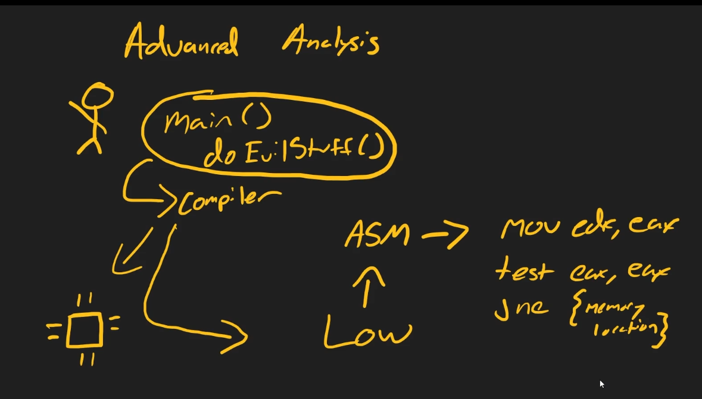
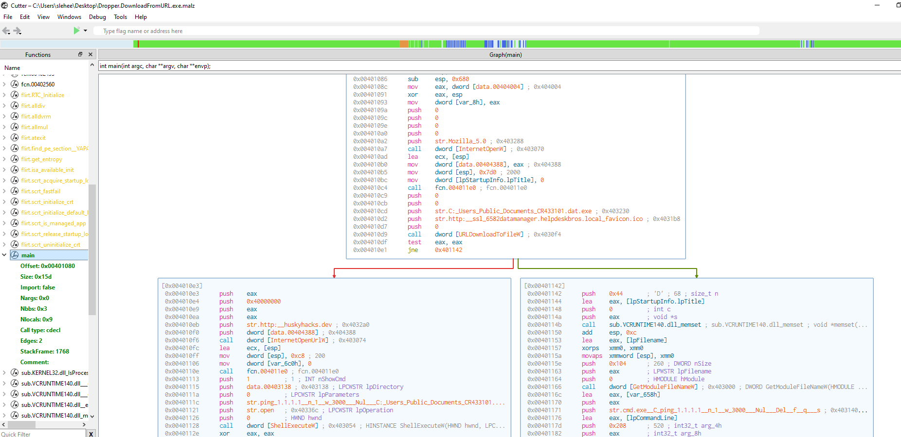
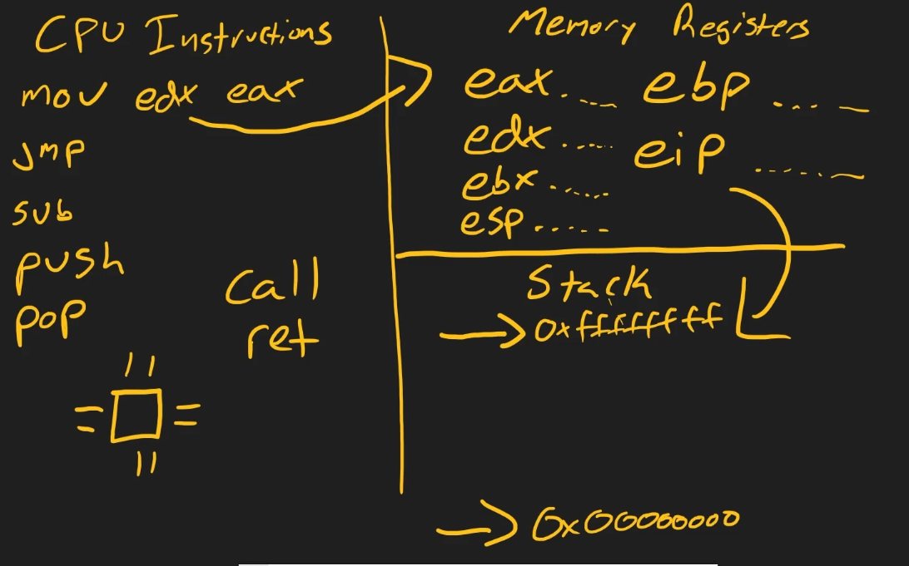

# Advanced Analysis & Assembley Language

**Advanced analysis**

Advanced analysis has two complementary parts: static and dynamic. What separates advanced from basic analysis is the depth and the methods used to inspect a binary.

**Advanced static analysis**

In advanced static analysis we examine the compiled program without running it. For Windows Portable Executables this means looking at the assembly (ASM) produced by the compiler. Because authors rarely provide source code, we load the packaged executable into decompilers and disassemblers to reconstruct readable code and recover the program's logical flow. The goal is to extract how the program was written and how it will execute, by reading assembly, cross-references, imports, and embedded data.

**Advanced dynamic analysis**

Advanced dynamic analysis means running the binary under a debugger so we can control and observe execution at the instruction level. A debugger gives precise control over every instruction: set breakpoints, step through code, inspect registers and memory, and watch how runtime state is constructed. This lets us see unpacking, decryption, dynamic imports, and other behaviors that only appear while the program runs.

**What is assembly?**

Assembly is a low-level, human-readable representation of the CPU's instructions. High-level source code (C, C++, Python, etc.) is translated by a compiler into machine code — patterns of bits and bytes the CPU executes. Assembly sits one level above those bit patterns and uses mnemonics like mov, test, and jne to represent operations (for example: mov eax, edx; test eax, eax; jne 0x401000). It is more cryptic than high-level code but far more informative about what the CPU will actually do.

**Key idea: abstraction**

Abstraction moves us from bits to instructions to human-language constructs. Programmers write in high-level languages for readability. Compilers lower that code into machine instructions; assembly exposes those instructions so we can reason about behavior on the bare metal.

**Next: lab**

We'll move into the lab to load a Windows PE, examine its assembly in a disassembler/decompiler, and trace its execution under a debugger to reconcile static findings with runtime behavior.

## Advanced Static Analysis Lab: Dropper Sample (`malware.unknown.exe.mals`)

In this lab, we revisit the dropper sample from earlier in the course to perform advanced static analysis using a disassembler/decompiler. The goal is to understand the program's logic, API usage, and control flow at the assembly level.

**Tool:** Cutter 

### 1. Opening the Sample in Cutter

- Launch Cutter and open the sample (`dropper.downloadfromurl.exe.mals`).
- Keep analysis enabled and use the default (auto/AAA) analysis level.
- The dashboard provides basic info: architecture, hashes (MD5, SHA-1, SHA-256), and more.

### 2. Exploring Functions and Entry Point

- In the left panel, review the list of all functions detected in the binary.
- Double-click the entry point to view the program's starting instructions.
- You'll see raw assembly code—this is the closest view to what the CPU executes.

### 3. Understanding Program Execution

- Every program has a `main` function, the central hub from which execution flows.
- Use Cutter to locate and open the `main` function.
- Look for familiar strings (e.g., `C:\Users\Public\Documents\CR433101.dat.exe`)—these often reveal file paths or indicators used by the malware.

### 4. Visualizing Logic with the Graph View

- Switch to the **Graph** tab to see a visual representation of the program's logic flow.
- The graph shows how instructions branch and connect, making it easier to follow conditional logic and function calls.

### 5. Key Findings: API Calls and Logic

- The binary contains a hardcoded URL (e.g., `ssl-6582datamanager.helpdeskbros.local/favicon.ico`).
- The program calls the Windows API function `URLDownloadToFileW` to download a file from this URL.
- The result of this API call is stored in the `EAX` register (the extended accumulator).
- The program tests the value of `EAX`:
  - If the download succeeds, it proceeds to execute the downloaded file.
  - If the download fails, it triggers self-deletion logic and removes itself from disk.
- This logic is visible in the graph as conditional jumps (e.g., `jne` instructions) between code blocks.

### 6. Decompiler View

- The **Decompiler** tab attempts to reconstruct high-level source code from the assembly.
- Here, you can see the API call (`URLDownloadToFileW`) and its parameters, making the program's intent clearer.
- Look for other familiar strings and function calls from your earlier static/dynamic analysis.

### 7. Analyst Tips

- Use the graph and decompiler views to trace the main logic: network access, file writing, and self-deletion.
- Try to find all the indicators (URLs, file paths, API calls) you identified in basic analysis.
- Practice following the flow from the entry point through the main function and into key API calls.

This approach demonstrates how advanced static analysis tools like Cutter help you move from raw assembly to a high-level understanding of malware behavior, bridging the gap between static indicators and real program logic.

## Recognizing Patterns in x86 Assembly

As you work more with assembly, you'll start to recognize common patterns and instructions. Here are the foundational concepts and instructions you'll encounter in x86 binaries:

### 1. Core Components of Execution

- **CPU Instructions:** The actual operations the CPU performs (arithmetic, data movement, control flow).
- **Memory Registers:** Special storage locations (like `EAX`, `EDX`) used to hold data temporarily.
- **The Stack:** A memory structure used to store variables, function arguments, and return addresses.

### 2. Types of CPU Instructions

- **Arithmetic Instructions:** e.g., `SUB` (subtract).
- **Data Movement Instructions:** e.g., `MOV` (move data between registers/memory).
- **Control Flow Instructions:** e.g., `JMP` (jump), `JNZ` (jump if not zero).

> **Note:** x86 is little-endian; instructions are written as `INSTRUCTION DESTINATION, SOURCE` (e.g., `MOV EDX, EAX` moves the value of `EAX` into `EDX`).

### 3. Stack Operations

- **PUSH:** Adds (pushes) data onto the stack (stack grows downward in memory).
- **POP:** Removes (pops) data from the stack, restoring previous state.

The stack is used to pass arguments to functions and store temporary data.

### 4. Function Calls and Returns

- **CALL:** Invokes a function (subroutine), saving the return address on the stack.
- **RET:** Returns from a function, restoring execution to the saved address.

#### Metaphor: Nested Function Calls

Think of the `main` function as your main task. If you call another function (e.g., `pickUpEggs`), you push its arguments onto the stack. If you get interrupted (e.g., need to `saveCatFromTree`), you call another function, pushing more data onto the stack. When done, you return to the previous function, using the stack to remember where you left off.

- The **base pointer** (`EBP`) helps keep track of where each function's stack frame begins, so you can always return to the right place.

---

## Memory Registers: The CPU's Read Heads

Think of memory registers like the read head of a VCR tape: as data streams by, the read head (register) grabs and processes the information needed at that moment. In x86 assembly, several key registers play specific roles:

- **EAX**: Accumulator register (general-purpose, often used for arithmetic and function return values)
- **EDX**: Data register (used for I/O operations and arithmetic)
- **EBX**: Base register (often used to point to data in memory)
- **ESP**: Stack pointer (tracks the top of the stack)
- **EBP**: Base pointer (marks the start of the current stack frame)
- **EIP**: Instruction pointer (points to the next instruction to execute)

At any time, these registers hold addresses, values, or pointers that facilitate the interaction between CPU instructions and the stack. They are essential for moving data, controlling program flow, and managing function calls.

---

**Pattern Recognition is Key**

Learning assembly and low-level execution is all about building pattern recognition. The more you work with these concepts, the more familiar the patterns become—making it easier to analyze and understand new binaries in the future.

---