## WannaCry

In the early summer of 2017, WannaCry was unleashed on the world. Widely considered to be one of the most devastating malware infections to date, WannaCry left a trail of destruction in its wake. WannaCry is a classic ransomware sample; more specifically, it is a ransomware cryptoworm, which means that it can encrypt individual hosts and had the capability to propagate through a network on its own.

## Objective

Perform a full analysis of WannaCry and answer the questions below.

## Challenge Questions

- Record any observed symptoms of infection from initial detonation. What are the main symptoms of a WannaCry infection?
- Use FLOSS and extract the strings from the main WannaCry binary. Are there any strings of interest?
- Inspect the import address table for the main WannaCry binary. Are there any notable API imports?
- What conditions are necessary to get this sample to detonate?
- **Network Indicators**: Identify the network indicators of this malware
- **Host-based Indicators**: Identify the host-based indicators of this malware. 
- Use Cutter to locate the killswitch mechanism in the decompiled code and explain how it functions.

## Static Analysis

Static analysis examines the malware sample without executing it. This provides an early view into the sample’s structure, imports, strings, and other static indicators that suggest capabilities and intent.


### Strings analysis

Extracting strings is a fast way to reveal hardcoded URLs, filenames, user-agent strings, or other indicators. Use `FLOSS` to extract and deobfuscate strings that are likely relevant:

```bash
cd /path/to/sample
floss.exe -n 8 WannaCry.exe > strings.txt
```

Review `strings.txt` for potential kill-switch domains, download URLs, file paths, or recognizable crypto-related identifiers.

### Floss
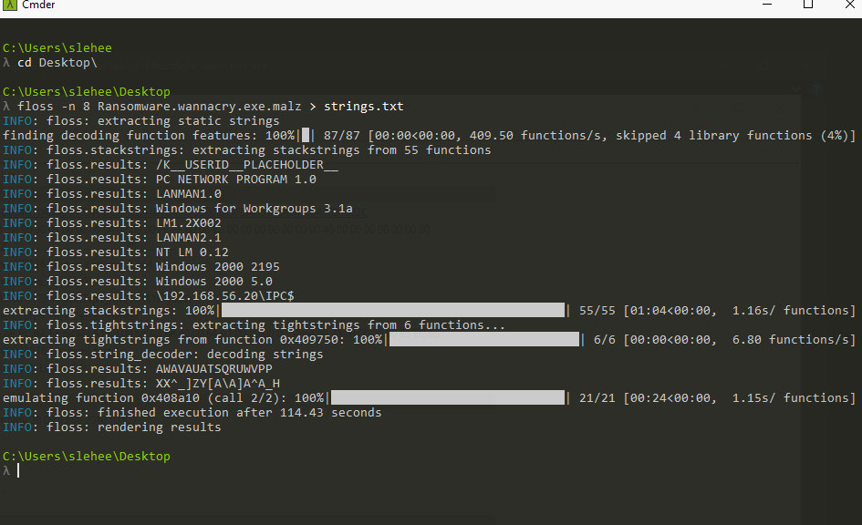

There are too many strings in the binary to check one by one. Some look random, but others contain useful information that can help us understand what the malware does.


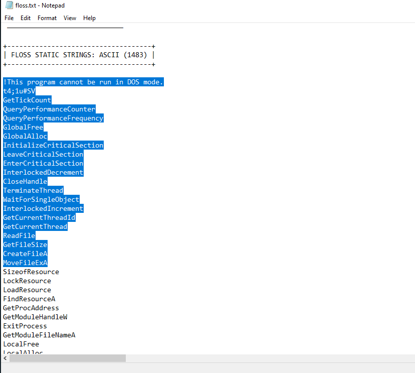

We can notice a bunch of API calls and it seems they are imported from other executables. One of the giveaway of that is the DOS header what we will see in couple of more times 

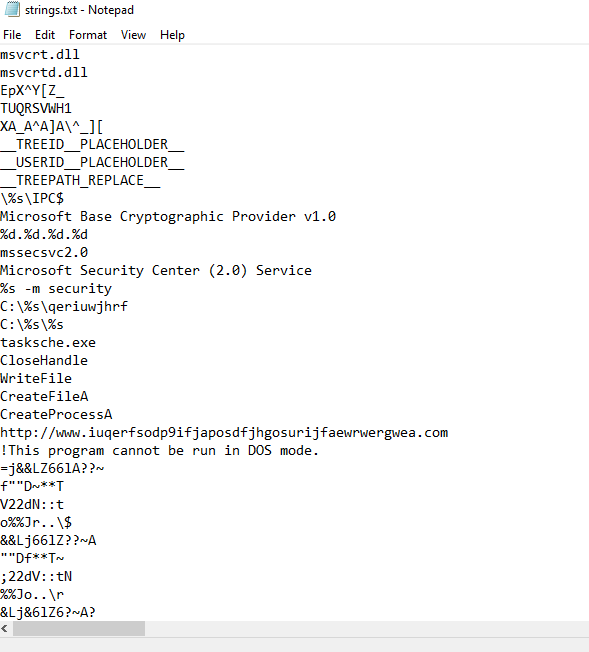

Can see windows binary like `icals` and the command `attrib +h .` suggests that it has some hidden directory somewhere!

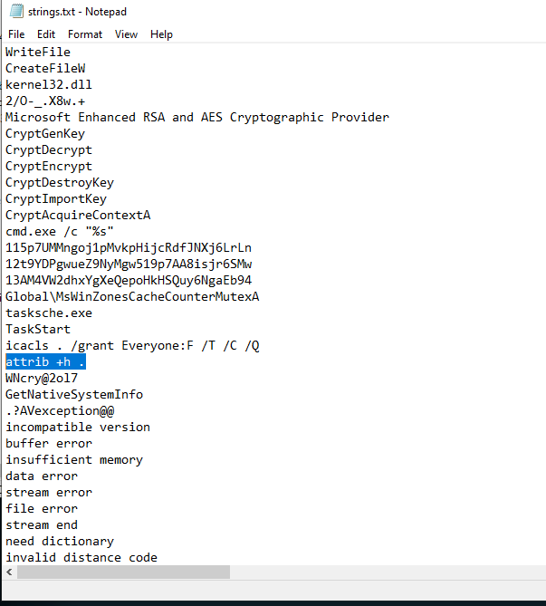


### PE Studio
Open the sample in `PE Studio` and inspect the Import Address Table. Check the **Indicators** view for notable items — in this case PE Studio shows three packed executables embedded in the first‑stage binary and it flags a URL.

Now check the **Libraries / Imports** section to see which DLLs and APIs are referenced. In this sample the Windows Sockets API (e.g., `ws2_32.dll`) and Windows Internet extensions (WinINet, e.g., `wininet.dll`) appear in the imports. That combination indicates the binary likely performs socket/network operations and uses higher‑level WinINet functions for HTTP requests or downloads. Follow‑ups: note the exact imported functions (e.g., `InternetOpen`, `InternetConnect`, `URLDownloadToFile`) and mark them as primary candidates for breakpoints during dynamic analysis.

A helpful next step is to sort the Imports by risk or use a blacklist filter to surface high‑risk APIs first. Near the top of the list we see several CryptoAPI entries (for example `CryptGenKey`, `CryptImportKey`, `CryptEncrypt`/`CryptDecrypt`) — consistent with ransomware behavior. This strongly suggests encryption operations are implemented in the binary. Recommended follow‑ups: record the exact crypto function names, trace their call sites in the decompiler, and set breakpoints on the crypto APIs to capture keys and observe encryption behavior during execution.

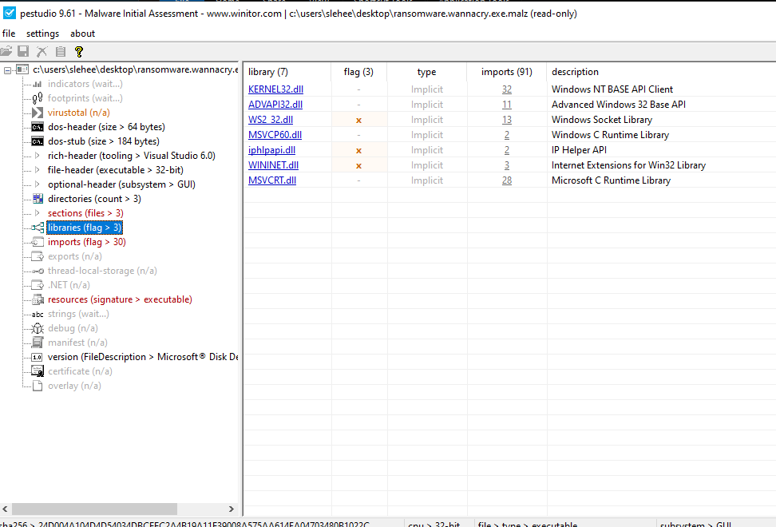

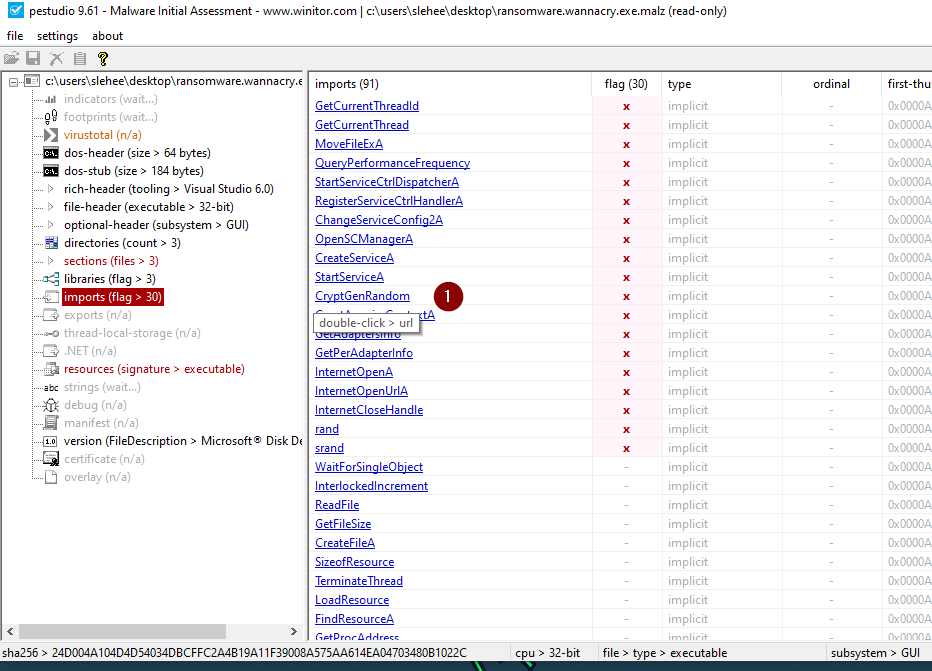

Checking the section sizes: Raw = 3,719,168 bytes, Virtual = 6,718,034 bytes. The virtual size is larger by 2,998,866 bytes (~2.86 MiB), an increase of about 80.6% over the raw size. Such a large Raw→Virtual gap is a strong indicator of packing or embedded payloads (high entropy sections, unpacking at runtime, or multiple embedded PE blobs).

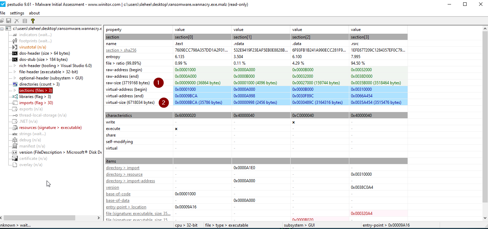

WannaCry will try to contact a specific URL (the long, weird one seen in strings and PE Studio). If it connects to this URL, the payload does not run.

Change the sample extension to .exe to arm it. Start INetSim and open Wireshark in Remnux.

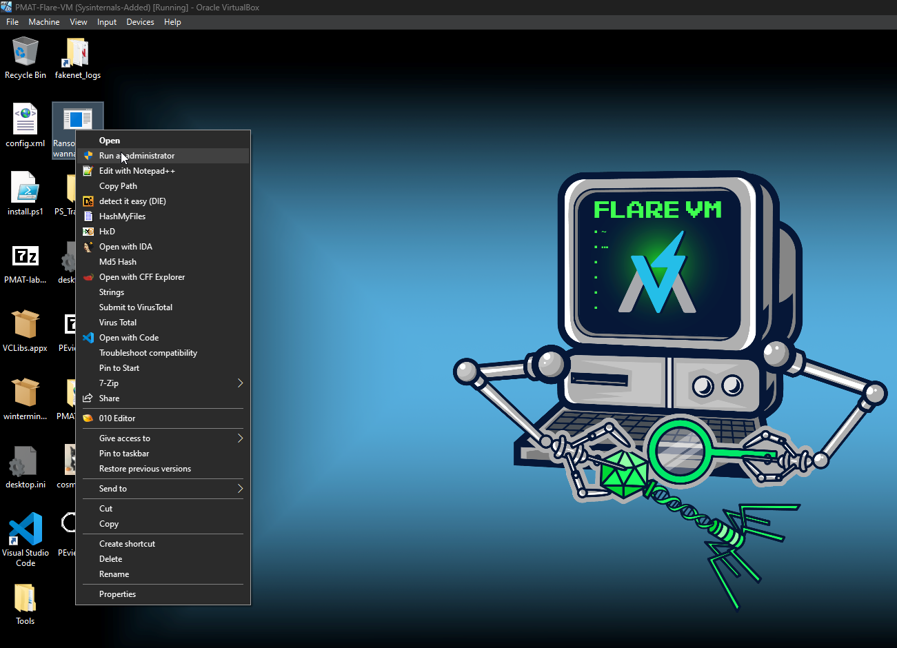

We see that after our TCP handshake, we have the HTTP packet that makes a request to `http://www.1uqerfsodp9ifjaposdfjhgosurijfaewrwergwea.com/`

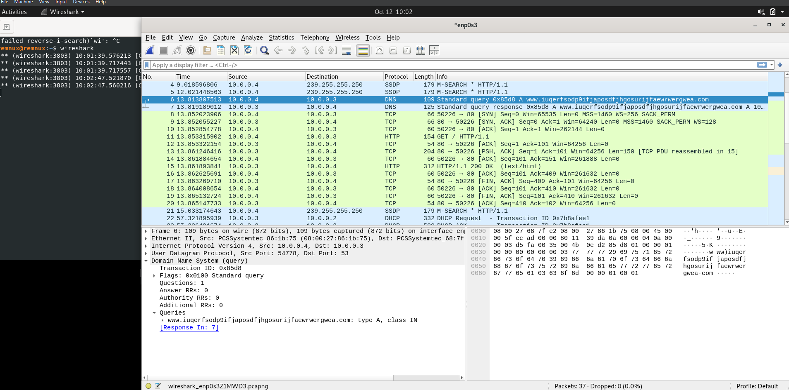


Now inetsim responds with a 200 OK for this

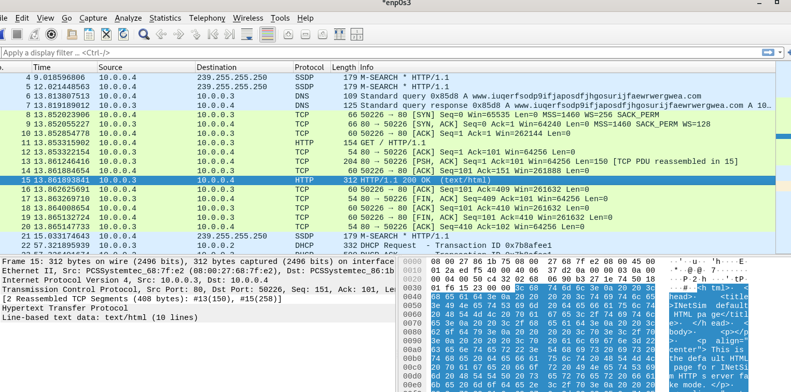

But if we go back to Flare VM, we see that this `WannaCry` does not execute. It does not run if it gets a 200 OK from the callback URL.

So, to proceed, go back to `Remnux` and press `Ctrl+C` to stop `inetsim`.

In Flare VM, open `cmder` and flush the DNS resolver cache:

`Command: ipconfig /flushdns`

**Therefore the conditions necessary to get the sample to detonate is we need inetsim to be turned off**


Now, to gather more network indicators for this sample, we can use tools on the endpoint itself.

Go to `sysinternalsSuite` (C drive) and find `TCPView`.

Run `TCPView` as Administrator. When you detonate the binary, you will see a lot of traffic going out to port 445 to remote addresses (for example, 169.254.130.1).

This means there is no real address connectivity—169.254.x.x is an auto-assigned IP address.

But notice all the network connections going out on port 445, which would normally be to different hosts on the network.

This shows how WannaCry tries to propagate itself. It is ransomware, but also a worm.

It spreads using the `EternalBlue` exploit, which targets Windows SMB. SMB uses port 445.

If you let the binary run for a while, you may see a new process called `takhsvc.exe` appear, which opens a listening port on 1950.

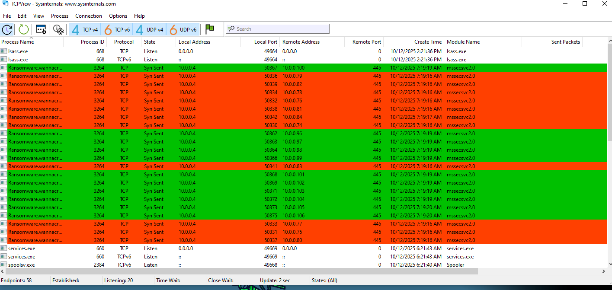

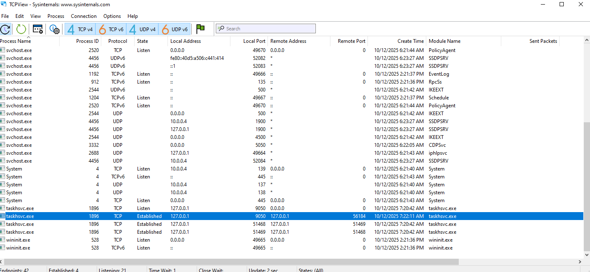

## Host based indicators:

We’ll go over to `Procmon` (Process Moniter) and open up the `Filter` tab
We will filter on a few different things , we can filter for the `Process Name contains wannacry`, which is our process and we can start with `Operation is createfile` So go ahead and hit OK and then run WannaCry as Administrator

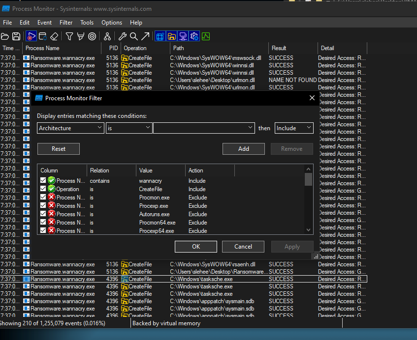

One of the first things that we notice is that there is a creation of a file called `taskhsvc.exe` which is in C windows, So we’ll go check that out.

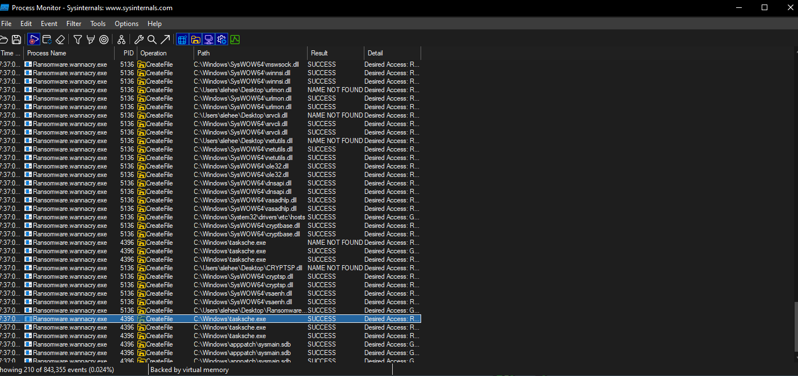


So given that there is another executable that is created from the initial executable, let’s go ahead and drill down on that.
One way to do that is by using the `Process tree`(Tab at top )
And it looks like from the original `WannaCry` binary `taskhsvc.exe` is unpacked and then run with an argument of ` /i`


Now let’s take the PID(process ID) of the original ransomware binary, and we’ll add that as the parent PID to see if we can identify what taskhsvc.exe might doing. So we will go to filter tab and add ‘Parent PID is xxx’ and hit add and remove the other criteria out given there.

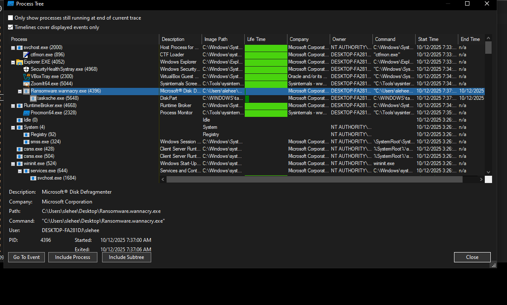

Now we can see that there is a process started and that’s the beginning of the execution of this secondary payload

Let’s go ahead and filter for `Operation is createfile` , add it and hit OK

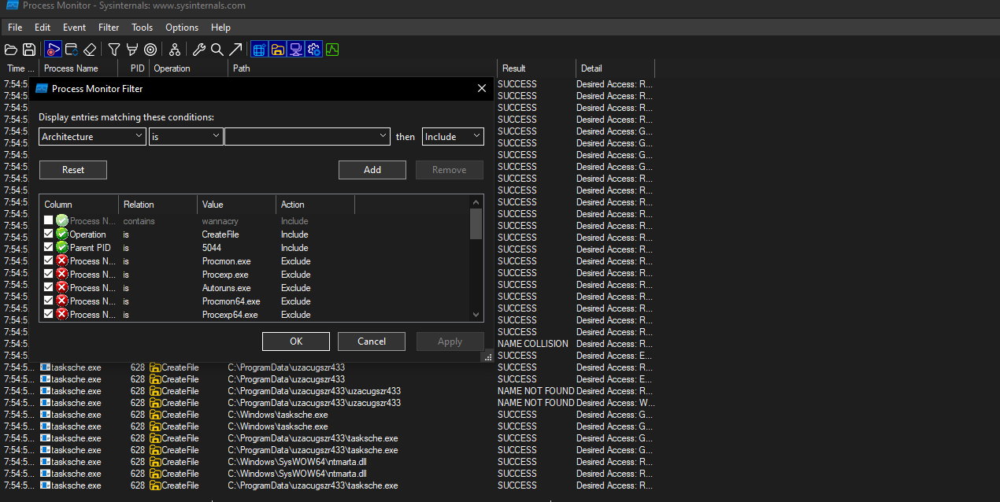

We see that in `C:\ProgramData` it appears that there is a strange name directory.

So we can open this up and see that this directory is right here.

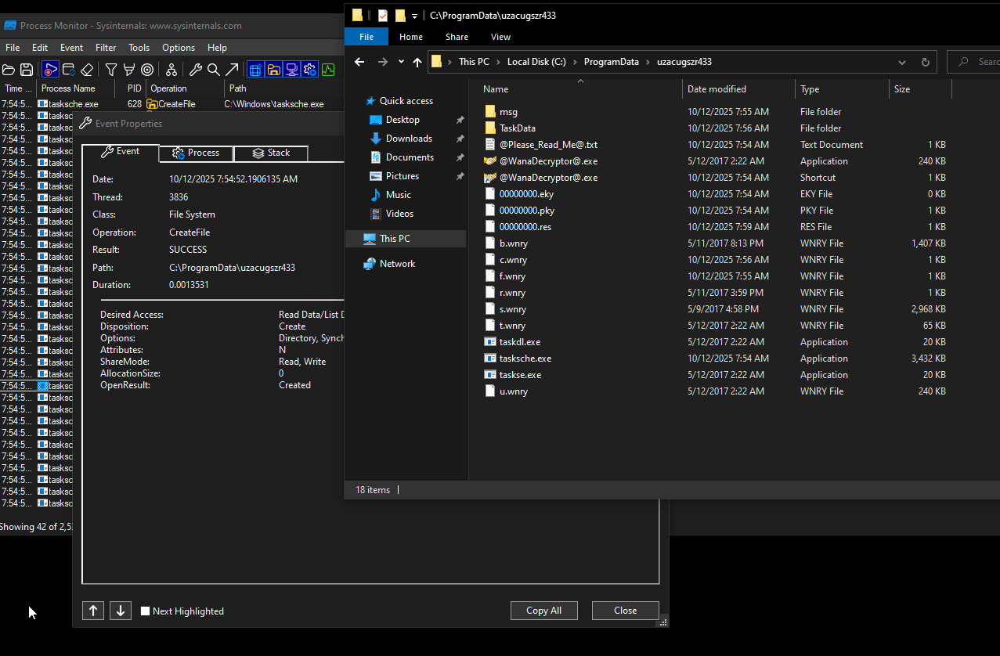


And so we can open this up, and this ends up being like a staging area for WannaCry’s execution and unpacking all of it’s packed resources. This is installed as a hidden directory that uses the `att_+h` cmd we saw in static analysis

**So this is the another host based indicator(that is the 2nd stage of WannaCry installing as hidden directory in the c:\ProgramData)**


Now when we see the service creation in the Task manager
In Services tab , we can see a service created in the same weird name as the folder name just we saw. And so this is the Persistence mechanism

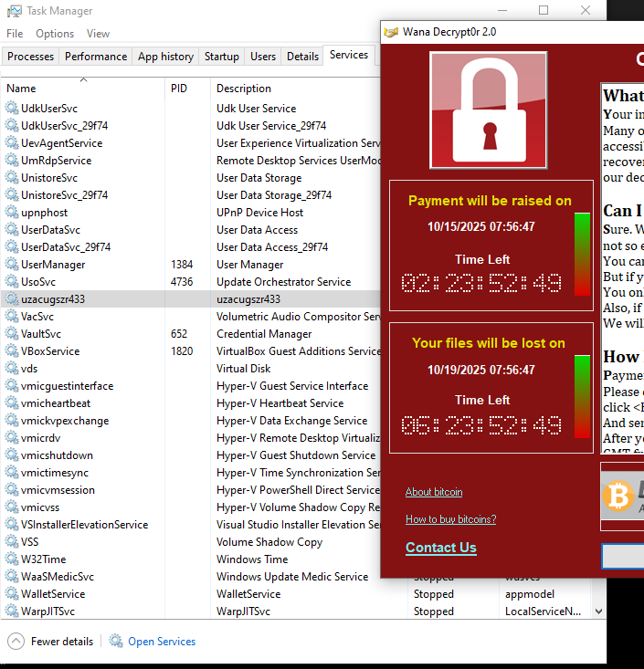


So this is the service that makes it so that if you restart the computer , WannaCry kicks back on and will re-encrypt anything that’s added to the host let it be USB drive or more files that are added.

Let’s take a look at kill switch function:

Open the tool `Cutter`, and we will start by finding the main function, and go to the graph mode view
`Cutter` is a free and open-source GUI reverse engineering platform It provides an interactive disassembler, decompiler, and debugger for analyzing binaries.

One of the first things that we can see is that string reference to this weird URL is loaded into ‘esi’ right at the beginning of the program.
Therefore, a whole bunch of arguments are marshaled to be able to make an API call


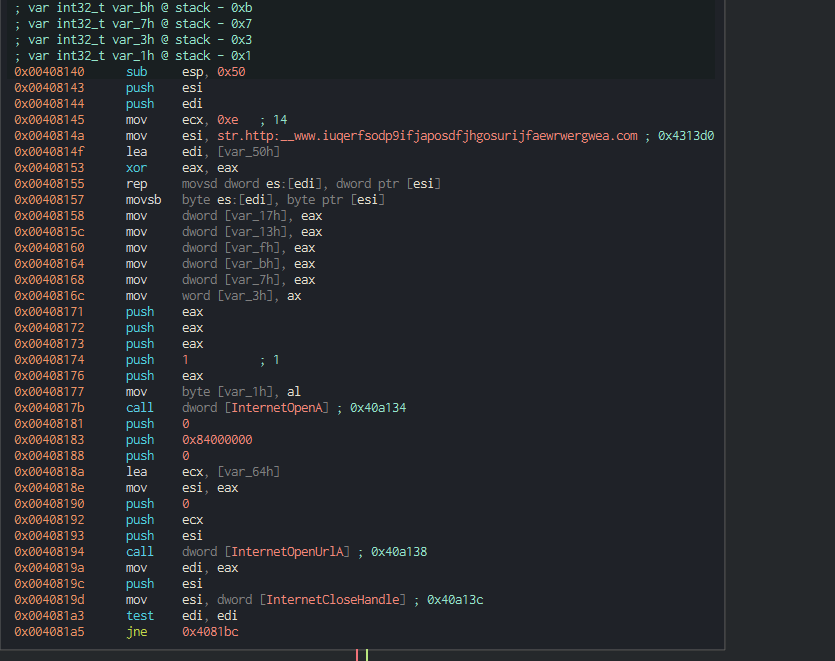

The first API call that we make is InternetopenA, so this is goin to prep to open up a handle to a given web resource , at this point the contents of `eax` are moved into `esi` and pushed on to the stack as well.


!!!note
    `ESI` is the source index register in x86 architecture. It is commonly used for string and memory operations, often serving as a pointer to source data in memory, but can also be used as a general-purpose register to hold values or pointers during function calls and data movement.

!!!note
    `EAX` is the primary accumulator register in x86 architecture. It is commonly used to store the result of operations or function return values, and is often used for passing data between instructions or API calls.

    
Then once we take a look at the `Decompiler tab` (down left), here the outcome of the `InternetopenA URL` is loaded into the register `eax` then it is loaded into the `edi` register.

!!!note
    `EDI` is the destination index register in x86 architecture. It is often used for operations involving memory copying, string manipulation, or as a general-purpose register to hold pointers or handles, especially in API call sequences.

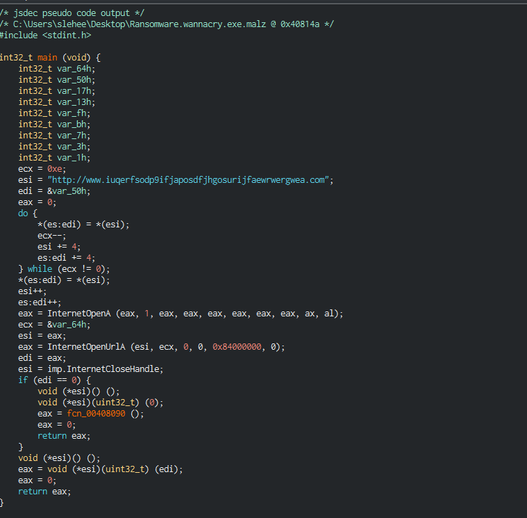

So basically the InternetopenA will return output as a binary value like yes or no value(1 or 0).
So the binary value is put into the `edi` register.

Now come back to the graph mode, right there is the test instruction for ‘edi’ to test itself and then there will be a jump for whatever is the value of `edi`

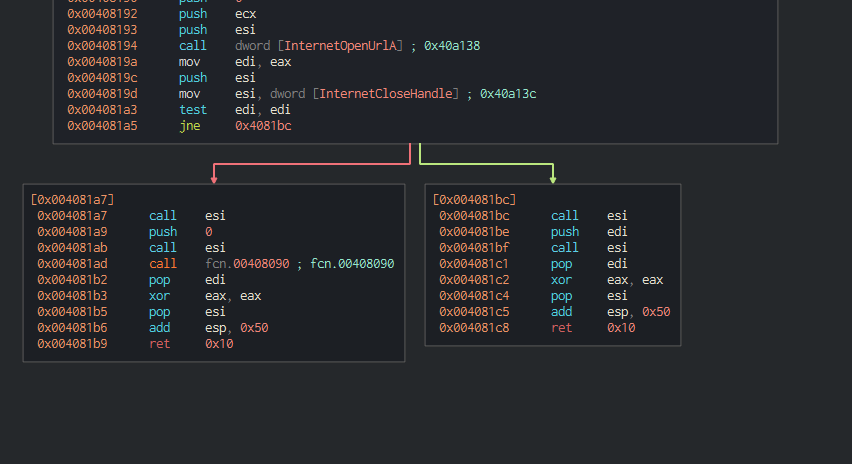

If `edi` is tested against itself and there is a zero in that value, the Zero flag is set to one. And then this `jne`(jump if not equal), the zero flag is evaluated ans whether or not the zero flag is set one of the two things will happen!

So if the outcome of this API call is true, so it reaches out to the specified URL and there is a result meaning the API call succeeds and it says there is a result here , we’re going to this location in memory.

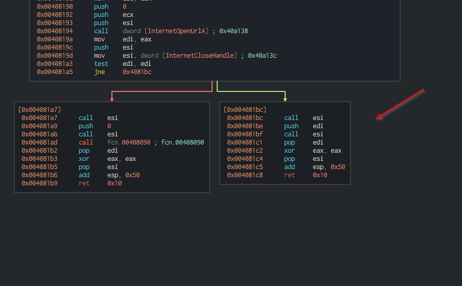

Now the opposite side of that, if this API call reaches out to the URL and there is nothing there, the zero flag will indicate that we're going to jump to this location.

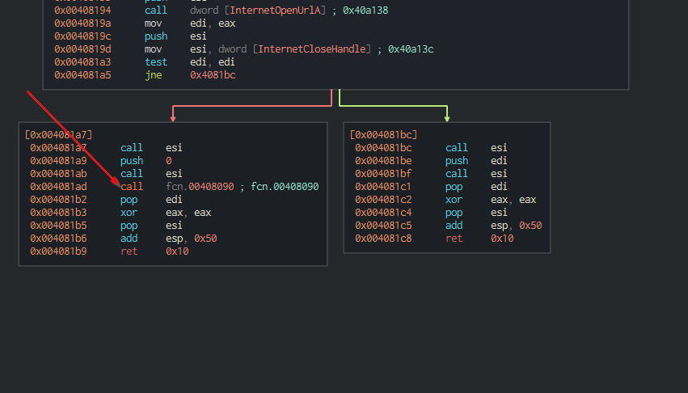

This location is almost exactly the same thing , but there’s one difference is this function call right here.
If we trace into this, is the rest of the encryption payload ,this installs itself as a service

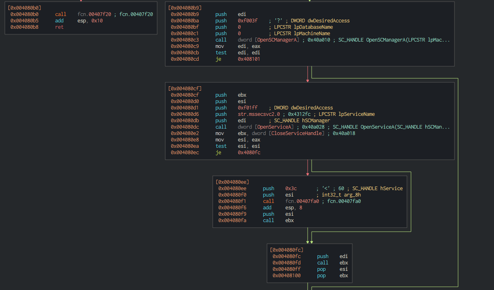

This opens up and unpacks the rest of the resources in wannacry’s binary
and it will kick off the encryption routine and wreck the computer that it is run on.

So this is the kill switch URL function, and the routine goes like:

**Check the URL**
**If there s a result , exit out of the program completely**
**If not result there , run the function call and this function call does every other part of the encryption and payload routine.**

So now let’s try to execute the program even if it gets result for that URL that it calls out.
Now run the inetsim on Remnux
Then in Flare VM go to ‘cmder’ and get the DNS resolver cache flushed out Command: ipco nfig/ flushdns

At this point, if we are to arm and detonate this binary, there should be no actual payload detonation because inetsim is up and running.
But let’s load this into a debugger!!!

So open the `x32 debugger` and attach the exe to the executable
Now we want find the main function , so hit `F9`

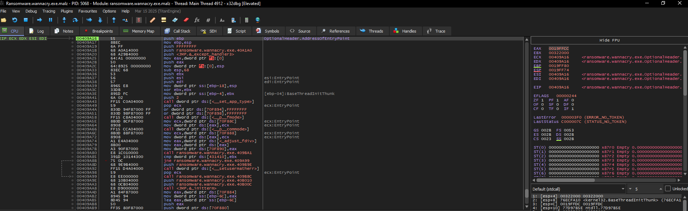

Open up the `search` and we’re going to search all modules for a string reference. And search for that wired `url(http://www.1uqerfsodp9ifjaposdfjhgosurijfaewrwergwea.com/)` in the search bar.
Then go ahead and set a breakpoint (toggle breakpoint)

The idea is that this is going to be loaded into that API call and pushed on to the stack at some point. So we want to find when that happens.
Then go to CPU view and hit F9 one time. And it seems that this is the point in which our random weird URL string is moved onto `esi`

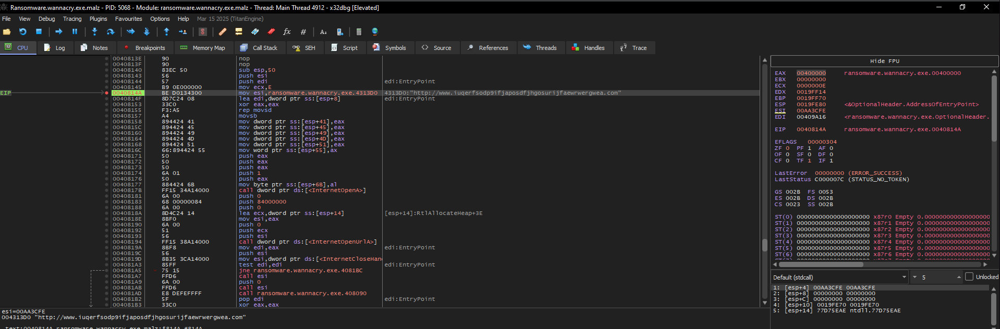

And we can correlate that because we see `InternetopenA` and `InternetopenurlA` are the API call right here